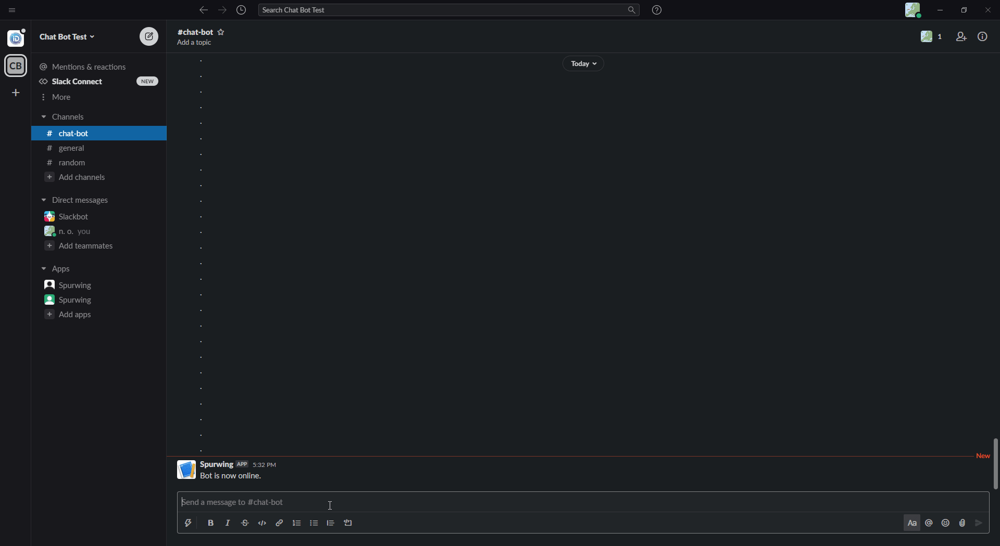

# Slack Bot for Appointment Scheduling

## Demo



## Intro

This is a demo project on the integration of the Spurwing API with Slack.

## Usage

`!opentimes [days from now (int)]` : Shows open time slots open in a number of days from the time called.

`!opentimes [date]` : Shows times open on a specific date.

`!book -d [date] -n [firstname lastname]` : Books an appointment for firstname lastname on a given date.
**This will also message you with an appointment ID. Keep this on hand as it will help you cancel the appointment.**

`!cancel [appointment id]` : Cancels an appointment based on appointment ID.

## Requirements
- NodeJS 12 or Newer
- Spurwing Provider ID
- Slack Classic Bot Application
- Slack Classic Bot Token

## How to host this bot:

### Make sure you have NPM and Node installed on your PC!

1. Git pull or save the Slack folder.

2. Go to [the slack api site](https://api.slack.com/apps/)

3. Create new app (Make sure it is a classic bot, or else the bot will fail to start!).

4. Go to the NodeJS folder and run `npm i`. This will install all dependencies.

5. Create a new file named `.env`.

6. Add this to the file: 

```js
TOKEN="replace this"
PREFIX="replace this"
PID="replace this"
APIKEY="replace this" // if you have it
```

7. On the slack site, click on your bot and on the left tab, click on "App Home".

8.  Add the bot on the second box.

9.  Go to "OAuth & Permissions" on the left tab.

10.   Add the bot with those scopes (classic doesn't allow for fancy customization).

11.   Copy the "Bot User Oauth Token".

12.   Replace the `replace this` with your token, and prefix respectively (recommended prefix: "!").

13.   Type `npm run server`.

Your bot should be online. If it throws an error immediately, feel free to remove the line `sendMessage('chat-bot', 'Bot is now online.');` in app.js. This will probably break something if you do not already have a channel in your Slack with the name chat-bot.

## Spurwing Integration

1. Log into the Spurwing Dashboard.

2. Click on the API Info tab.

3. Copy the Provider ID and API Key (the API key is not mandatory but it may be useful for some functions)

4. Replace the `replace this` with your credentials.

5. Test the bot to see if everything worked correctly!
